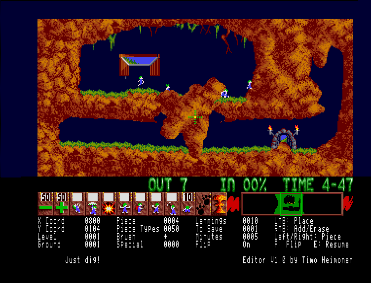

# Lemmings In-Game Level Editor

A patch that adds an in-game terrain editor to Amiga Lemmings (1991).



Watch it in action: [YouTube](https://youtu.be/q9s-7uenz_o)

## Requirements

- Amiga 500, Kickstart 1.3, 512K chip + 512K slow RAM, PAL
- Python 3.8+ (for `patch.py`)
- [vasm](http://sun.hasenbraten.de/vasm/) `vasmm68k_mot` (only for `build.py`)
- Your own copies of these disk images:

| Image | SHA-256 |
| --- | --- |
| `Lemmings Disk 1` | `a4fdba69017f1a760bba3bb06c55f7e434226c498c9d22c1f627212b08d24f91` |
| `Lemmings Disk 2` | `1526000b96d196efecab9c63aa72c0ce6257649a4993141b00ead8738fd97a65` |

Other versions are rejected.

## Patch

```sh
python3 patch.py "Disk 1.adf" "Disk 2.adf" -o out
```

Inputs are matched by hash, in any order, and never modified. Output:
`Lemmings_Disk1-editor-patch.adf` and `Lemmings_Disk2-editor-patch.adf`.

## Controls

| Key | Action |
| --- | --- |
| `E` | Enter / leave editor (pauses the level) |
| Cursor left / right | Previous / next terrain piece |
| `F` | Flip piece vertically |
| LMB | Place piece |
| RMB | Toggle add / erase |
| Cursor at screen edge | Scroll |

## Limitations

- Terrain only: entrances, exits, traps and other objects cannot be edited.
- Edits live in memory only.
- One-player mode only.
- Needs 512K slow RAM. Without it the game boots and plays normally, just
  without the editor.
- The status block uses the extra lines of a PAL display; on NTSC it may be
  cut off.

## Build

```sh
python3 build.py
```

Assembles `src/*.s` and embeds the binaries in the generated section of
`patch.py`, so end users need only Python.

## How it works

- `src/bootstrap.s` is appended to the game's main program. At start-up it
  reserves 128K at the top of slow RAM and loads the `Editor` file from disk 2
  into it. Without slow RAM the game runs unpatched.
- `src/editor.s` hooks the main loop, keyboard interrupt and level setup. It
  freezes the level through the game's own pause flag, paints pieces straight into the
  live terrain (graphics and collision) and draws a status block below the
  skill panel via a copper list extension.
- `patch.py` adds the bootstrap and two jump hooks to the program file on
  disk 1 and the editor file to disk 2, using the game's own disk directory.

## Docs

Addresses, hooks and data formats are documented in [docs/](docs/):
[patch points](docs/patch-points.md), [memory map](docs/memory-map.md) and
[game internals](docs/game-internals.md).

## Legal

Lemmings is the property of its original rights holders (DMA Design /
Psygnosis). This project is not affiliated with them and contains no game
files. The editor code is released under the [MIT License](LICENSE).
