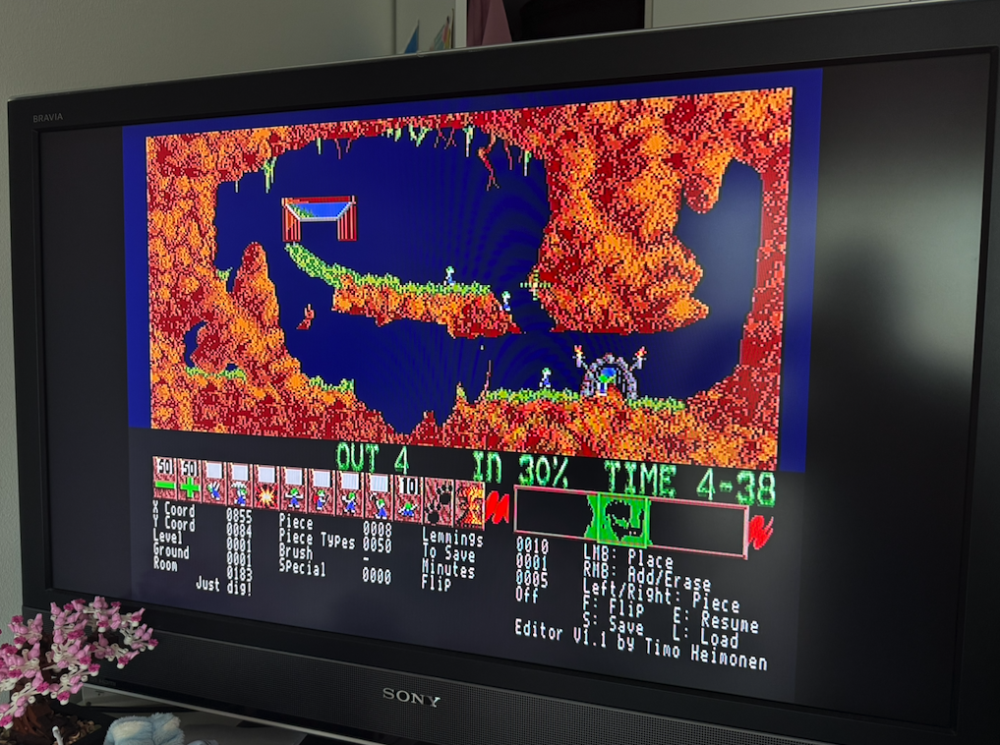

# Lemmings In-Game Level Editor

A patch that adds an in-game terrain editor to Amiga Lemmings (1991), with
named saves per level on a separate save disk.



Watch it in action: [YouTube](https://youtu.be/N6VEIr_eumY)

## Requirements

- Amiga 500, Kickstart 1.3, 512K chip + 512K slow RAM, PAL; one or two
  drives
- Python 3.8+ (for `patch.py` and `savedisk.py`)
- [vasm](http://sun.hasenbraten.de/vasm/) `vasmm68k_mot` (only for `build.py`)
- Your own copies of these disk images:

| Image | SHA-256 |
| --- | --- |
| `Lemmings Disk 1` | `a4fdba69017f1a760bba3bb06c55f7e434226c498c9d22c1f627212b08d24f91` |
| `Lemmings Disk 2` | `1526000b96d196efecab9c63aa72c0ce6257649a4993141b00ead8738fd97a65` |

Other versions are rejected.

## Patch

```sh
python3 patch.py "Disk 1.adf" "Disk 2.adf" -o out
```

Inputs are matched by hash, in any order, and never modified. Output:
`Lemmings_Disk1-editor-patch.adf` and `Lemmings_Disk2-editor-patch.adf`.

## Save disk

Create an empty save disk image, or initialize any spare disk from the menu
in the game:

```sh
python3 savedisk.py create out/Lemmings_SaveDisk.adf
```

`savedisk.py` also lists, checks, exports, imports and deletes saves and
rebuilds the index (`python3 savedisk.py --help`). Keep `bases.json` next to
it. Saves can be exchanged as `.lemsave` files or whole save disks between
users of the same version. Details: [save disk](docs/save-disk.md).

## Controls

| Key | Action |
| --- | --- |
| `E` | Enter / leave editor (pauses the level) |
| Cursor left / right | Previous / next terrain piece |
| `F` | Flip piece vertically |
| LMB | Place piece |
| RMB | Toggle add / erase |
| Cursor at screen edge | Scroll |
| `S` / `L` | Save / load menu for the current level |

In the menu:

| Key | Action |
| --- | --- |
| Cursor up / down | Select a row |
| Cursor left / right | Previous / next page (16 rows) |
| Return | Save or load the selected row; on `-- New save --`, enter a name (1-16 characters) |
| Del | Delete the selected save |
| `R` | Rebuild the save index |
| `Y` / `N` | Answer a question |
| Esc | Back / leave the menu |
| LMB | Select a row, click again to confirm; `<` `>` change the page |
| RMB | Same as Esc |

Loading restarts the level from the beginning with the saved terrain. With one
drive the menu asks for the save disk, and afterwards for disk 2 again. With
two drives, put the save disk in DF0: after booting (disk 1 is no longer
needed) and leave disk 2 in DF1:. The game disks are never written to.

## Limitations

- Terrain only: entrances, exits, traps and other objects cannot be edited.
- Up to 400 terrain placements including the original pieces; up to 32 saves
  per level and 318 per save disk.
- One-player mode only.
- Needs 512K slow RAM. Without it the game boots and plays normally, just
  without the editor.
- The status block uses the extra lines of a PAL display; on NTSC it may be
  cut off.

## Build

```sh
python3 build.py
```

Assembles `src/editor.s` (which includes the other sources) and
`src/bootstrap.s`, splits the editor image at `editor2_start`, packs both parts
in the game's own format, checks the memory layout, and embeds the results in
the generated section of `patch.py`, so end users need only Python.

## How it works

- `src/bootstrap.s` is appended to the game's main program. At start-up it
  reserves 128K at the top of slow RAM, loads `Editor2` from disk 1 and then
  `Editor` from disk 2 into it, and unpacks both with the game's own unpacker.
  Without slow RAM the game runs unpatched.
- `src/editor.s` hooks the main loop, keyboard interrupt and level setup. It
  freezes the level through the game's own pause flag, paints pieces straight into the
  live terrain (graphics and collision) and draws a status block below the
  skill panel via a copper list extension.
- `src/menu.s` is the save/load menu, `src/save_load.s` builds save records
  and replays them when the level restarts, `src/disk_io.s`,
  `src/disk_codec.s` and `src/disk_index.s` read and write the save disk
  directly through the disk hardware (MFM tracks, verified writes).
- `patch.py` adds the bootstrap and three jump hooks to the program file and
  `Editor2` to disk 1, and `Editor` to disk 2, using the game's own disk
  directory.

## Docs

Addresses, hooks and data formats are documented in [docs/](docs/):
[patch points](docs/patch-points.md), [memory map](docs/memory-map.md),
[game internals](docs/game-internals.md) and [save disk](docs/save-disk.md).

## Author

Timo Heimonen <timo.heimonen@proton.me>

## Legal

Lemmings is the property of its original rights holders (DMA Design /
Psygnosis). This project is not affiliated with them and contains no game
files. The editor code is released under the [MIT License](LICENSE).
