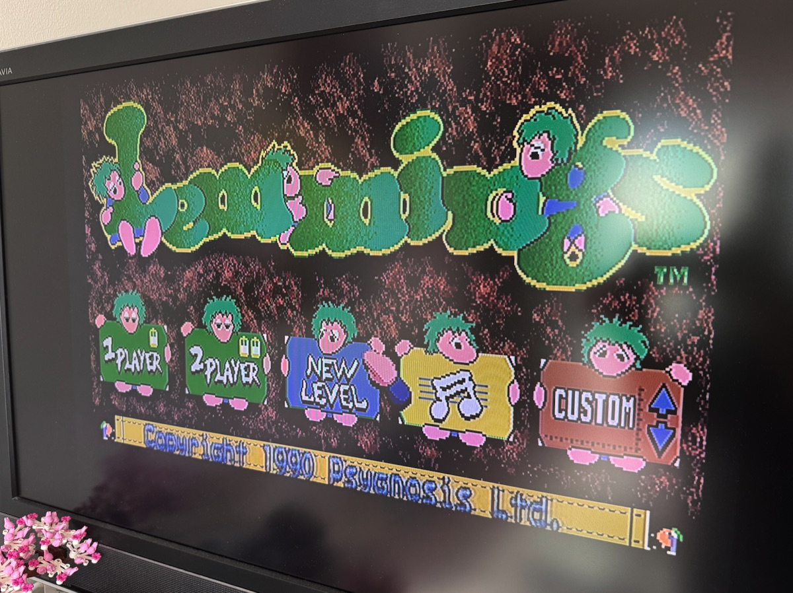
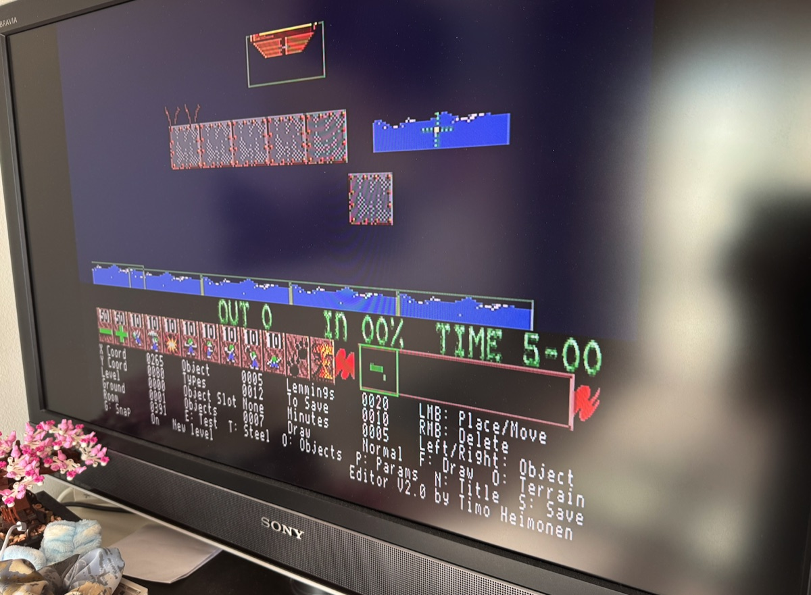

# Amiga Lemmings (1991) Integrated Level Editor for 1P and 2P Levels

A patch that adds custom levels to Amiga Lemmings (1991): an in-game level
editor that runs natively on the Amiga, inside the original game and its
engine. No PC tools are needed to make a level.

On the title screen, CUSTOM follows FUN, TRICKY, TAXING and MAYHEM, with a
list of your own levels, for one or two players, and New Level to create
one. Levels are saved on a level disk and can be shared as `.lvl` files.
For floppy (A500) and as a WHDLoad install for hard disk.

This is version 2. Version 1.x, an editor for the terrain of the original
levels, is a separate line; see [Version 1.x](#version-1x).





More photos from an A500: [two players in a custom level](docs/images/lemmings_2p_custom.jpg)
and [a level for two players in the editor](docs/images/lemmings_2p_custom_editor.jpg).

## Requirements

- Amiga 500, Kickstart 1.3, 512K chip + 512K slow RAM, PAL; one or more
  drives; a second mouse (joystick port 2) for two players
- Python 3.8+ (for `patch.py` and `savedisk.py`)
- [vasm](http://sun.hasenbraten.de/vasm/) `vasmm68k_mot` (only for `build.py`)
- Your own copies of these disk images:

| Image | SHA-256 |
| --- | --- |
| `Lemmings Disk 1` | `a4fdba69017f1a760bba3bb06c55f7e434226c498c9d22c1f627212b08d24f91` |
| `Lemmings Disk 2` | `1526000b96d196efecab9c63aa72c0ce6257649a4993141b00ead8738fd97a65` |

Other versions are rejected.

## Patch

```sh
python3 patch.py "Disk 1.adf" -o out
```

Only disk 1 is patched; the input is matched by hash and never modified.
Output: `Lemmings_Disk1-editor-patch.adf`. Disk 2 is used unchanged (it may
be given too, in any order; it is then only checked).

## Level disk

On floppy, custom levels are kept on a level disk. Create an empty one and
write it to a spare disk, or use the image on a Gotek or in an emulator:

```sh
python3 savedisk.py create out/Lemmings_LevelDisk.adf
```

`savedisk.py` also lists, checks, imports, exports and deletes levels and
rebuilds the index (`python3 savedisk.py --help`). Keep `styles.json` next to
it. A level disk holds 318 levels. Levels are exchanged as `.lvl` files: a
`.lvl` file is exactly the game's 2048-byte level record and contains no
original level data. Details: [level disk](docs/level-disk.md).

## WHDLoad

```sh
python3 patch.py "Disk 1.adf" "Disk 2.adf" --whdload out/Lemmings
```

Writes a WHDLoad install (slave, disk images, Workbench icon and the
directory `Levels`) for Kickstart 2.0 or later. Custom levels are `.lvl`
files in `Levels`; no level disk is needed. Started from its icon, WHDLoad
writes a saved level to the hard disk at once. See
[whdload/README.md](whdload/README.md).

## Custom levels

On the title screen, step the difficulty sign past MAYHEM to CUSTOM with
its up arrow. In CUSTOM:

- **1 Player** opens the list of custom levels, ten per page, with their
  titles. A click or Return plays the selected level, `E` opens it in the
  editor; the cursor keys select and turn pages; the right button or Esc
  returns to the title screen. A played level returns to the list.
- **2 Player** lists the levels made for two players and plays them in the
  game's own two-player mode (two mice, split screen): one level per match,
  then the winner and back to the list.
- **New Level** asks for a graphics style (dirt, fire, marble, pillar,
  crystal), for one or for two players, and opens a new level in the editor:
  20 lemmings, 10 to save, 5 minutes, 10 of every skill, an entrance and an
  exit (for two players an exit for each player).

On floppy the list looks for the level disk in every drive and asks for it
when it is missing. With one drive, the list asks for disk 2 again before a
level starts and before it returns to the title screen, and the editor after
saving.

### Levels for two players

A level is for two players when it has an entrance, two or more exits and
the marker: the first object of type 2 (in the dirt style a flag). Lemmings
leaving through an exit next to the marker count for the green player,
through the other exits for the blue player, as in the game's own
two-player levels. Each player gets 40 lemmings (the level's number of
lemmings is not used in two-player mode). In the editor, `M` on an exit puts
the marker beside it, and the status block shows `2 Players` `Yes` or `No`.
The editor and its test play are for one player; play a two-player level
from 2 Player after saving it.

## Editor

The editor opens paused at the start of the level, before the first lemming.
The status block below the skill panel shows the mode, its values and keys.

| Key | Action |
| --- | --- |
| `T` | Steel areas (`T` again: terrain) |
| `O` | Objects (`O` again: terrain) |
| `P` | Parameters (`P` again: terrain) |
| `N` | Change the title |
| `S` | Save the level |
| `E` | Test play from the start; `E` or Esc during the test play returns to the editor |
| `G` | Snap on or off: new and moved pieces and objects join the nearest one of the same kind |
| `U` | Undo the last edit (three steps); Shift+`U` redoes it |
| Esc | Back to the list; asks first when the level has unsaved changes |
| Cursor at screen edge | Scroll |

Terrain:

| Key | Action |
| --- | --- |
| Cursor left / right | Previous / next terrain piece |
| LMB | Place the piece |
| RMB | Toggle add / erase |
| Shift + LMB while erasing | Delete the outlined piece under the cursor |
| `F` | Flip the piece vertically |
| `B` | Behind: draw the piece behind existing terrain |

An erasing piece cuts a hole of its shape into the pieces placed before it
and, like any piece, takes one of the level's 399 places, because the game
draws the level from its list of pieces. To remove a piece itself, switch to
erasing and hold Shift: the brush is hidden, the piece under the cursor is
outlined (an erasing piece too), and LMB deletes it, which frees its place.

Steel areas: drag with LMB to add an area (up to 16 x 16 cells of 4 x 4
pixels from the cell where the drag begins, 32 areas); RMB removes the area
under the cursor.

Objects: cursor left / right select an object of the style (entrances,
exits, traps, decorations); LMB places it or drags an existing one; RMB
deletes it; `F` cycles the drawing mode (normal, only on terrain, behind
terrain, both); `M` on an exit puts the two-player marker beside it.

Parameters: cursor up / down select the release rate, lemmings, to save,
minutes, one of the eight skills or the start position; cursor left / right
change it, with Shift in steps of ten.

Saving asks for the title, then writes the level to the level disk (under
WHDLoad to its `.lvl` file; a new level gets the first free `LevelNNN.lvl`).
Every level is checked against the game's own limits before it is saved. The
game disks are never written to.

## Limitations

- Up to 399 terrain pieces, 32 objects (at most four entrances; exits, traps
  and other triggered objects in the first 16 slots) and 32 steel areas per
  level, the game's own limits.
- A custom level is the Amiga game's own level record with the graphics of
  the five styles. The editor cannot choose a special background or the
  music; the music follows the level's number in the list. A level with a
  special background (from a `.lvl` file) takes no terrain pieces.
- The editor and its test play are one-player; two-player levels are played
  from the 2 Player list.
- Version 2 does not use V1.x save disks: it refuses one and never writes to
  it.
- Needs 512K slow RAM. Without it the game boots and plays normally, just
  without custom levels.
- The status block uses the extra lines of a PAL display; on NTSC it may be
  cut off.

## Build

```sh
python3 build.py
```

Assembles `src/editor.s` (which includes the other sources) and
`src/bootstrap.s`, twice: for floppy and with `WHDLOAD` defined for the
WHDLoad install. Packs each editor image in the game's own format and checks
the memory layout. Also assembles the WHDLoad slave and builds the install's
icon (`whdload/build.py`), and embeds everything in the generated section of
`patch.py`, so end users need only Python.

## How it works

- `src/bootstrap.s` is appended to the game's main program. At start-up it
  reserves 128K at the top of slow RAM, loads `Editor` from disk 1 while
  disk 1 is still in a drive and unpacks it with the game's own unpacker.
  `Editor` is stored on tracks 151..159 of disk 1, which the game never
  reads. Without slow RAM the game runs unpatched.
- `src/title.s` adds CUSTOM to the title screen; `src/levels.s` is the list
  of custom levels and starts them through the game's own level start,
  briefing and result screens, for two players in the game's own two-player
  mode.
- `src/editor.s` hooks the main loop, keyboard interrupt and level setup,
  draws terrain pieces into the level's terrain and shows a status block
  below the skill panel via a copper list extension. `src/steel.s`,
  `src/objects.s` and `src/params.s` edit the steel areas, the objects and the
  parameters and set the game up again from the level record after every
  change. `src/undo.s` keeps the undo history and rebuilds the terrain under a
  removed piece; `src/delete.s` deletes whole pieces.
- `src/level_save.s` checks and saves the level, `src/menu.s` is the menu
  for the title, disk prompts and messages, and `src/disk_io.s` and
  `src/disk_codec.s` read and write the level disk directly through the disk
  hardware (MFM tracks, verified writes).
- `patch.py` adds the bootstrap and three jump hooks to the program file and
  puts `Editor` behind the boot loader of disk 1, using the game's own disk
  directory.
- `whdload/` holds the WHDLoad slave and the file access that replaces the
  floppy disk code in the WHDLoad build.

## Docs

Addresses, hooks and data formats are documented in [docs/](docs/):
[patch points](docs/patch-points.md), [memory map](docs/memory-map.md),
[game internals](docs/game-internals.md) and [level disk](docs/level-disk.md).
The WHDLoad version is documented in [whdload/docs/](whdload/docs/).

## Version 1.x

Version 1.x (V1.0 to V1.2.1) is an in-level terrain editor for the 120
original levels, with named saves per level on a save disk. It lives on the
[`v1-maint`](https://github.com/timoheimonen/Amiga-Lemmings-Editor/tree/v1-maint)
branch with its own README; its releases are the tags `v1.0` to `v1.2.1`. It
is maintained separately and gets fixes there when needed.

The two versions are separate: version 2 has no editor for the original
levels and does not use V1.x save disks (it recognises one and never writes
to it), and version 1.x does not use level disks.

## Author

Timo Heimonen <timo.heimonen@proton.me>

## Legal

Lemmings is the property of its original rights holders (DMA Design /
Psygnosis). This project is not affiliated with them and contains no game
files. The editor code is released under the [MIT License](LICENSE).
