# Holiday Lemmings 1994 level editor: architecture

08.10.2026 Timo Heimonen (timo.heimonen@proton.me)

This document describes how the custom level editor, version 2.3.1, is
built into Holiday Lemmings 1994, which runs on the Lemmings engine: what
runs where, how the editor becomes part of the game's program, and how
editing, playing and saving a custom level use the game's own code. It
covers both versions, the patched floppy disk and the WHDLoad install. It
is written for readers of the sources: the editor (`src/`: `editor.s` and
the files it includes) and the WHDLoad files (`whdload/src/`). The
editor's sources are the same for Lemmings and Holiday Lemmings 1994; the
parts that are the same in both games are described in more detail in
[Lemmings level editor: architecture](architecture-lemmings.md).

The game is an AmigaDOS program whose hunks the system loads anywhere in
memory, so addresses are offsets into a hunk, written "hunk 2 `$0344`", and
hunk 2 is meant where no hunk is named. The editor's names for them are in
`game_holiday94.i`, which gives every address as a hunk base (`H1`, `H2`,
`H3`, `H5`) plus an offset. A5 points to the game's global variables at
hunk 2 `$77DE`, and the game keeps A4 at its row offset table, hunk 2
`$7908`; inside its hooks the editor uses A4 for its own state and sets it
back before it enters the game's code.

## The idea in short

The editor is not a separate program. It becomes two more hunks of the
game's own program, and it runs inside the game: the game's own code loads,
builds, draws and plays every level, and the editor adds a fifth rating,
its list of custom levels and its editing tools at a small set of hooks.

- **The level is the game's own record.** A custom level is the 2048-byte
  level record the game copies to hunk 2 `$9B38` for every level it plays,
  the same format as in Lemmings. A `.lvl` file is exactly that record, and
  the editor keeps one record as the level being edited and sets the game
  up again from it after every change. Only levels in the game's two
  styles, Brick and Snow, are accepted.
- **The game's code does the work.** Loading the style's graphics, the
  briefing, building the terrain and the objects, the attribute grid, the
  skill panel, the minimap, play, the result screens and the text screen of
  the list are the game's routines. The editor adds a CPU compositor for
  the terrain brush, the status block below the skill panel and its menu.
- **A level is edited only at its start.** The editor opens paused at the
  first frame of the level, before the first lemming is released; every
  change sets the game up again as a level start does, and a test play
  starts the level again through the game's own level loader.
- **The hooks are in the program file, each one checked.** The patch tool
  accepts only the supported disk and executable by SHA-256, checks the
  original bytes of all 16 sites it changes, writes the jumps into the
  game's code hunk and removes the relocations inside them. Nothing is
  patched at run time except a few places that change only while they are
  needed; the WHDLoad slave changes 4 more places, each after checking its
  original bytes.
- **The operating system stays.** The game runs in user mode with the
  system present, takes the hardware over and gives it back around its file
  reads. The editor's file access does the same with dos.library on floppy;
  under WHDLoad the slave and the editor use WHDLoad's file functions.
- **The game's own levels are unchanged.** Each hook does the replaced
  instructions and goes on where the game would, unless a custom level is
  being played or edited. The game's rating stays at BLIZZARD while CUSTOM
  is shown, and what the list changes is put back when it returns to the
  title screen.

## Components

The floppy version:

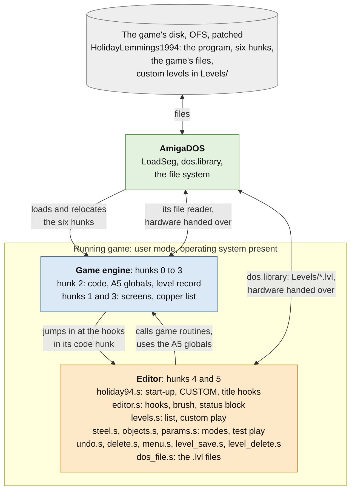

The WHDLoad install:

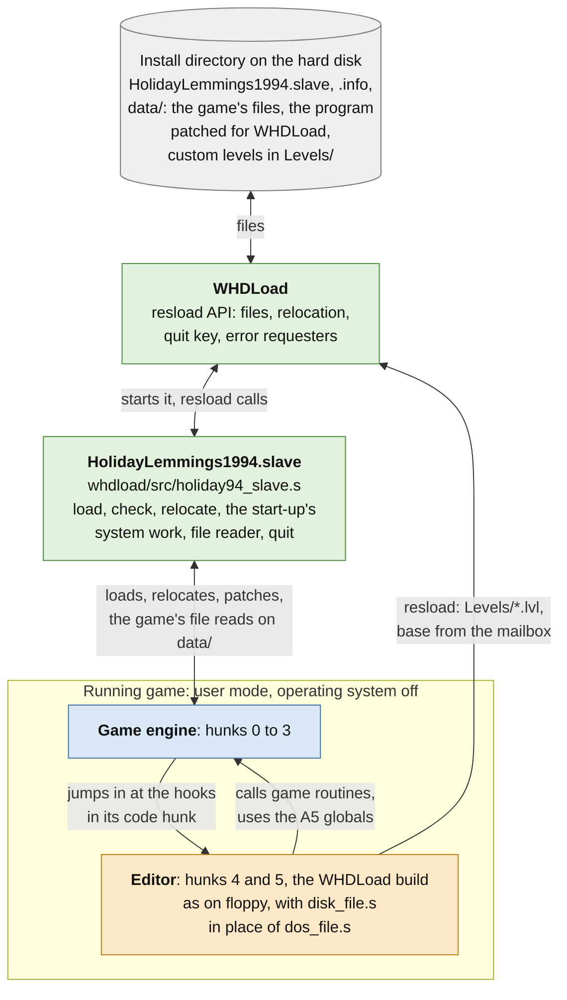

| Part | Source | Role |
| --- | --- | --- |
| Game engine | `HolidayLemmings1994` (the user's own) | Hunks 0 to 3 of the program; in its code hunk only the 16 hook sites change. It still runs the title screen, every level, the briefings and the result screens. |
| Editor | `editor.s` and the files it includes, assembled with `HOLIDAY94` | Hunk 4 holds the code, the data and the storage, hunk 5 the status block in chip memory. Adds CUSTOM to the title screen, the list of custom levels, New Level, the edit view with its status block and menu, test play, saving and deleting. Its own code is position independent; its references to the game's hunks are relocations. |
| Start-up and title hooks | `holiday94.s` | Installs the editor from the game's start-up and adds CUSTOM to the rating sign, PLAY and NEW LEVEL. |
| File access | `dos_file.s` (floppy), `whdload/src/disk_file.s` (WHDLoad) | The `.lvl` files, behind the same interface: the register interface of WHDLoad's resload functions. |
| WHDLoad slave | `whdload/src/holiday94_slave.s` | Loads and relocates the program, does the start-up's work that needs the operating system, replaces the game's file reader with `resload_LoadFile` on `data/` and turns the game's ways back to the system into a quit. |
| Patch tool | `patch.py` | Accepts only the supported disk by SHA-256, adds the editor's two hunks with their relocations, writes the 16 jumps and the directory `Levels`, and checks the whole file system before writing the image. With `--whdload` it builds the version for the WHDLoad install. |

## Memory

The patch tool makes the program six hunks; the system's loader puts each
one in memory of its type, wherever it finds room:

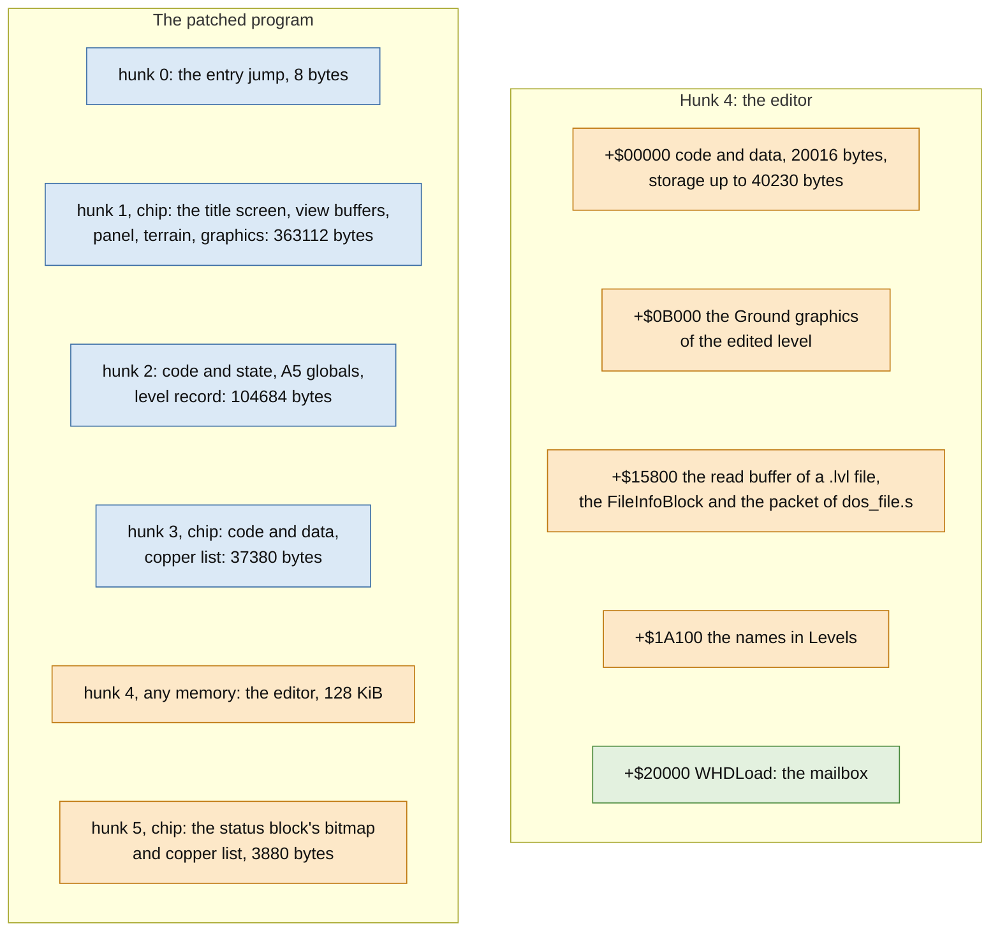

The editor needs its 128 KiB in one piece of any memory and 3880 bytes of
chip memory; on an A500 with 512 KiB of chip and 512 KiB of slow memory
hunk 4 lands in the slow memory. The code and data of the WHDLoad build are
19218 bytes, its storage reaches 39432 bytes. As in Lemmings, most of the
storage is the list, two level records, the placements of the terrain
brush, the font and the undo history, and the Ground graphics are the
editor's own copy of the style's terrain pieces, because the game overwrites
its own copy with sound data.

Under WHDLoad the slave relocates the program into WHDLoad's two areas, as
the system's loader would place it:

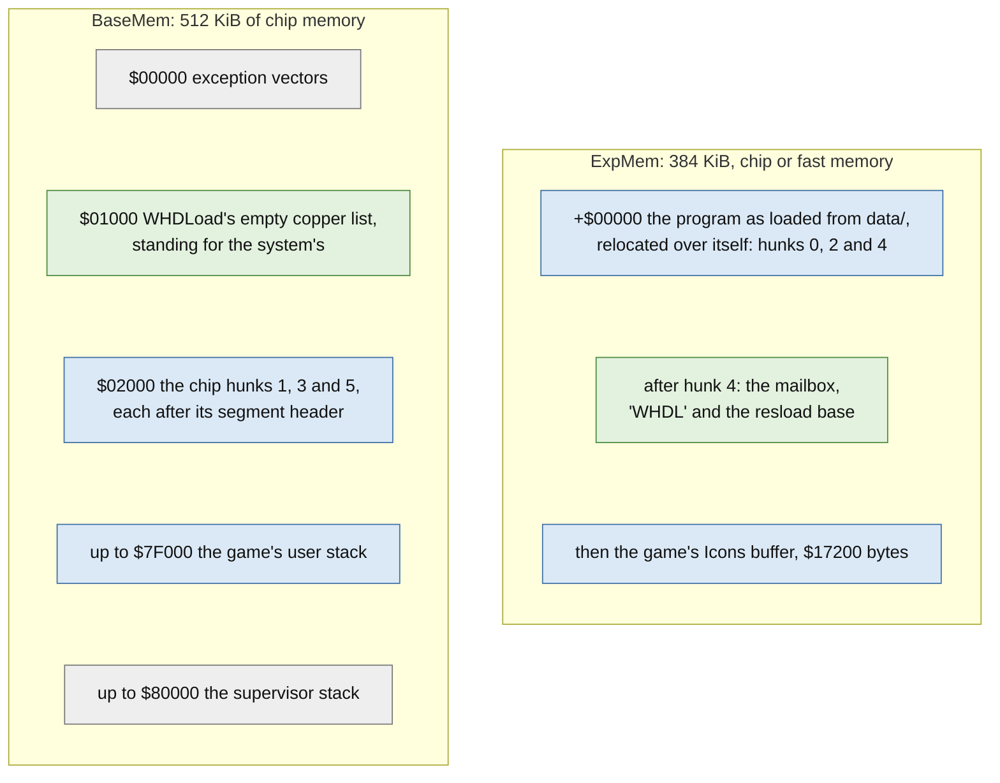

On floppy the game allocates its Icons buffer itself; under WHDLoad the
slave puts it above the mailbox, so the editor finds the mailbox directly
above its hunk.

## Start-up

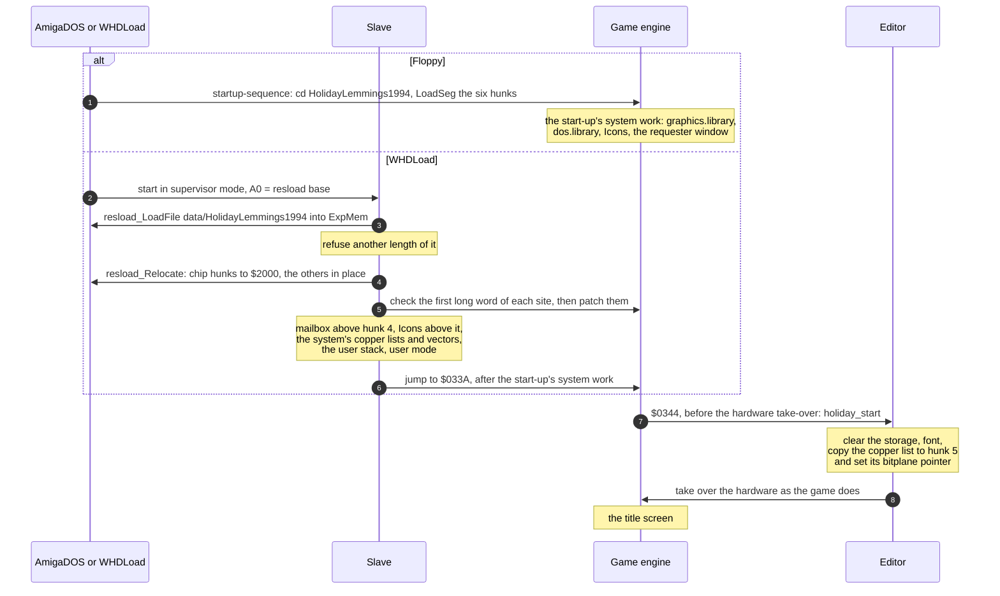

The editor is installed by the first of its hooks, while the system still
runs; the other hooks are already in the program file, so `install` writes
nothing into the game. The only addresses the system's loader cannot
relocate are the two copper words that hold the status block's bitmap
pointer, which `install` sets.

## Hooks into the game engine

The editor runs only when the game jumps to it. When there is nothing for
the editor to do (the game's own levels, a custom level played from the
list while the editor is closed, the title screen outside CUSTOM) each hook
does the replaced instructions itself and goes on where the game would.

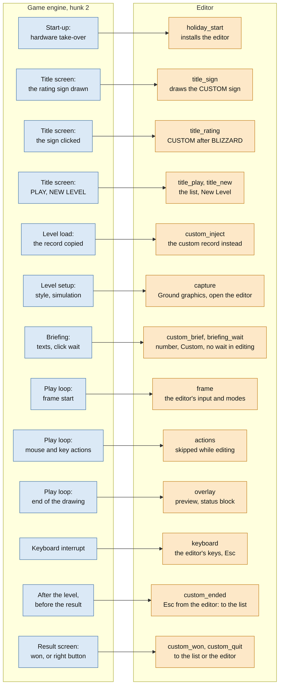

The 16 hooks the patch tool writes into hunk 2 (a `JMP` and `NOP`s; at
`$3068` a `JSR`):

| Hook | Offset | Replaced instructions | What the editor does |
| --- | --- | --- | --- |
| `holiday_start` | `$0344` | `BSR TAKE_OVER` / `LEA GAME_ROWS,A4`: the start-up takes the hardware over | Installs the editor, then the two |
| `keyboard` | `$13B2` | The raw key store / the CIA handshake | Keeps both; follows the Shift keys; queues key presses for the menu and the list; while a custom level is edited takes the editor's keys, and passes its Esc to the game as a release |
| `frame` | `$0482` | `BSR SWAP_BUFFERS` / `CLR.W G_FRAMES(A5)`: the play loop's frame start | Opens the editor at the first frame of an edited level and pauses it; runs the editor's input, modes and menu; skips the frame's drawing when nothing visible changed, and lets the level's fade-in go on |
| `actions` | `$04AE` | `BSR PLAY_MOUSE` / `BSR PLAY_KEYS` | Skipped while the editor is open |
| `overlay` | `$04B6` | `BSR PANEL_REFRESH` / `BSR MINIMAP_COLUMN` | After them, the brush preview, the outlines and the status block, then the buffer swap |
| `capture` | `$22D0` | `BSR SELECT_STYLE` / `BSR INIT_SIMULATION`: level setup | Resets the editor; for an edited level loads and unpacks the style's Ground graphics into hunk 4 and arranges for the editor to open at the first frame, except in a test play |
| `custom_inject` | `$2254` | `LEA LEVEL_RECORD,A0` / `MOVE.W $1A(A0),D0`: level load, after the copy | For a custom level copies its record over the game's; marks the level bank cache stale |
| `custom_brief` | `$3068` | `BSR BRIEF_TEXTS` / `BSR BRIEF_PREVIEW` | The level's list number, the rating `Custom` and `;` for `:` in the title |
| `briefing_wait` | `$30B4` | `BSR WAIT_CLICK` / `LEA FADE_BLACK,A0` | No wait for a level being edited or test played |
| `custom_ended` | `$053A` | `CLR.B G_MUSIC(A5)` / `LEA ENDED_TEXTS,A1`: the level has ended | After leaving the editor with Esc, back to the list without a result screen |
| `custom_won` | `$0590` | `CLR.B G_RESULT_SHOWN(A5)` / `MOVE.W G_LEVEL(A5),D0`: enough saved | The comment and a click, then the list, or after a test play the editor; no next level, no access code |
| `custom_quit` | `$06D8` | `LEA FADE_BLACK,A0` / `BSR FADE`: right button after a failed level | Back to the list, or after a test play to the editor |
| `title_sign` | `$27A2` | `MOVE.W #$280,D0` / `MOVE.W #$D0,D1`: the rating sign | In CUSTOM, the CUSTOM sign: FROST's with the editor's lettering |
| `title_rating` | `$3174` | `MOVE.W G_RATING(A5),D0` / `ADDQ.W #1,D0`: the sign clicked | After BLIZZARD, CUSTOM; after CUSTOM, FROST |
| `title_play` | `$301E` | `TST.B G_PANEL(A5)` / `BEQ.W`: PLAY | In CUSTOM, the list of custom levels |
| `title_new` | `$2FF2` | `CMPI.W #$BC,D0` / `BLE.W`: NEW LEVEL | In CUSTOM, the styles for a new level |

Writing the hooks into the file instead of the running code also keeps a
68020's instruction cache out of the way.

Changed only while they are needed:

| Place | Address | Changed while | Change |
| --- | --- | --- | --- |
| Play copper list: the display window | hunk 3 `$002A` | the editor is open | DIWSTOP `$24C1` instead of `$F4C1`: 48 more lines below the skill panel |
| Play copper list: its end | hunk 3 `$01A4`, 12 bytes | the editor is open | `COP2LCH`, `COP2LCL` and `COPJMP2` to the continuation in hunk 5, which shows the status block's hires plane |
| Play colours 0 to 4 | hunk 3 `$004A` | the menu is open | The menu's colours; the level's are put back when it closes |
| Skill selection sprite | hunk 3 `$8C94` | the editor is open | Cleared |
| Pause flag | `$19(A5)` | the editor is open | Set: no lemming is released, the objects and the clock stand still |

The WHDLoad slave's patches:

| Patch | Offset | Game code | Replacement |
| --- | --- | --- | --- |
| Suspend | `$0160` | Gives the hardware back, opens a console window and waits for Return | `RTS` |
| Quit | `$0256` | QUIT on the title screen: back to the system | `resload_Abort`: WHDLoad quits |
| Keyboard | `$13BE` | The keyboard interrupt's CIA handshake | The same, then F10 quits |
| File reader | `$2DF8` | Reads a file through dos.library | The same hand-over of the hardware around the read, the file from `data/` with `resload_LoadFile` |

The slave also checks that the two `NOP`s after the editor's start-up jump
are there, so that it never runs a program without the editor's hooks.

## Screens and control flow

As in Lemmings, the list, the New Level styles and the delete question are
drawn on the game's text screen, custom play, test play and the edit view
use the game's level start, briefing, play view and result screens, and the
editor's menu is drawn with its own font over the paused level.

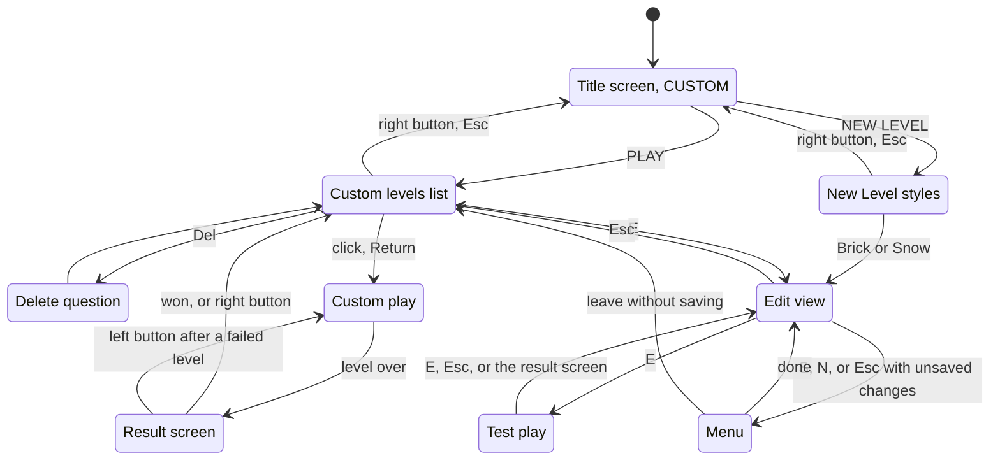

When the list opens from the title screen it keeps the game's level number,
text mode and the count of failed tries the access code holds. A custom
level is played as a level of rating 0, with its number in the list modulo
17 as the level number for the tune; the editor clears the game's tune flag
when it leaves or restarts a level. When the list returns to the title
screen the rating is BLIZZARD again, below CUSTOM, and the kept values are
put back.

## The edit view

Opening a level for editing starts it as for play, and the editor opens at
its first frame, as in Lemmings: while the game loads the level, its level
setup hook loads the style's
`ground1` or `ground3` with the game's file loader into hunk 4 and unpacks
it for the brush, the briefing does not wait for a click, and the frame
hook sets the pause flag, hides the skill selection sprite and shows the
status block.

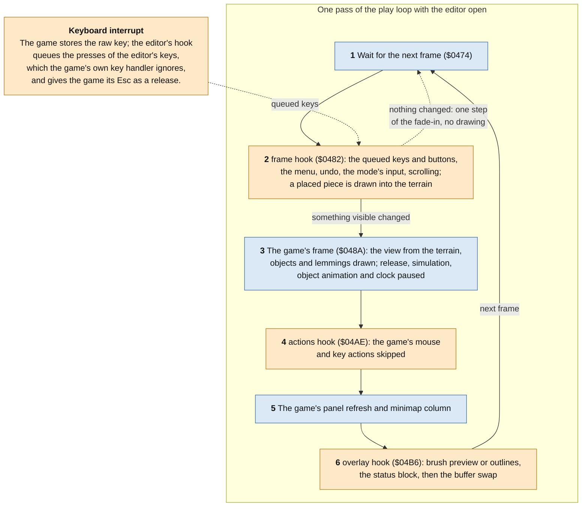

Blue steps are the game's routines, orange ones the editor's. Every tool
changes the record being edited, and the game's play data follows from it
by the game's own routines:

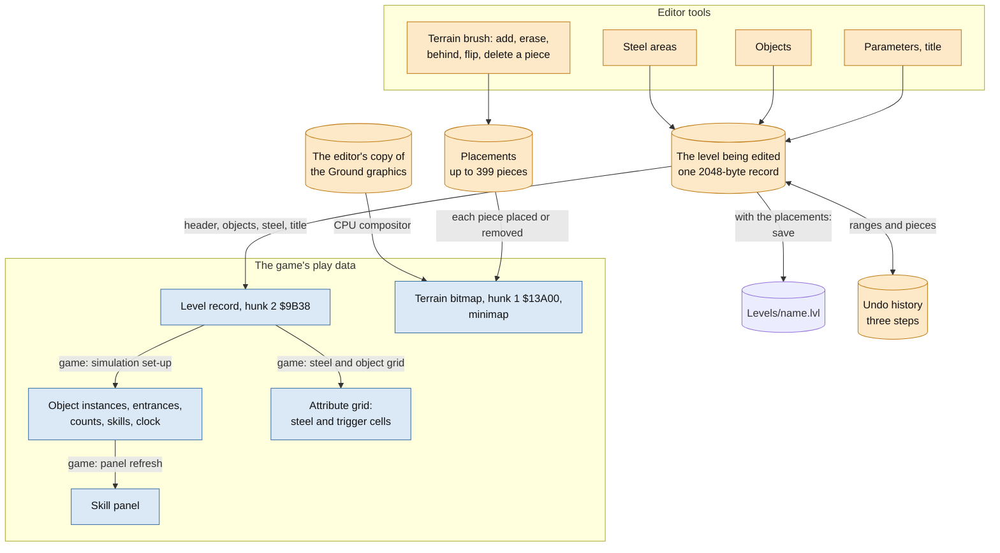

The terrain brush, the steel areas, the objects, the parameters, undo,
deleting pieces, saving, test play and leaving work as in Lemmings
([the edit view](architecture-lemmings.md#the-edit-view)). What the game makes
different:

- **The display.** The play view has two buffers of four planes, 44 bytes
  by 192 rows each, shown 160 rows high, and the skill panel's first
  bitplane (hunk 1 `$10800`) follows the second buffer's fourth plane from
  its row 176. The editor clears only the view's 160 rows when it draws its
  menu, and draws the object preview with the game's blitter routine
  clipped to those rows (the routine's surface height, hunk 2 `$78F2`).
- **The fade-in.** The game fades the play view in inside the play loop.
  When the frame hook skips a frame's drawing it still runs one step of the
  fade, and the editor lets the fade end before a menu keeps the level's
  colours.
- **User mode.** The game runs in user mode, so the editor keeps the
  interrupts away from what it shares with them with INTENA's master bit,
  not with the status register.
- **The graphics.** The style data's terrain piece pointers are offsets
  into the Ground file and its object frame pointers offsets into the
  Objects file (hunk 1 `$357E0`); the editor adds the bases. The attribute
  grid has 44 rows.

## Playing a custom level

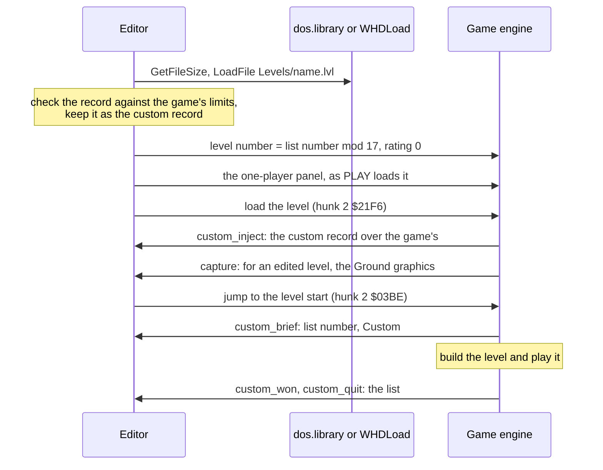

The game selects a level by copying its record from a level bank to hunk 2
`$9B38`. The hook after that copy puts the custom record there instead, so
the game's own loader, style loading, level build and play run on the
custom level unchanged; the game's cache of the unpacked level bank is
marked stale, so that the next original level is copied again. Holiday
Lemmings 1994 has no two-player mode, so there is no two-player list and no
match hooks.

## Files

Custom levels are `.lvl` files in the directory `Levels`, on floppy in the
current directory (`HolidayLemmings1994/Levels` on the game's own disk when
it is started from it or from Workbench), under WHDLoad in the install's
directory. The list, saving and deleting call the same functions in both
versions, at the offsets and with the registers of WHDLoad's resload
functions: on floppy `dos_file.s` provides them as a table of branches at
those offsets, under WHDLoad `disk_file.s` returns WHDLoad's own base from
the mailbox.

| What | How |
| --- | --- |
| The list of custom levels | `ListFiles` on `Levels`: up to 318 `.lvl` names, sorted, into hunk 4; the titles of a page are read from their files |
| Opening and playing a level | `GetFileSize`, then `LoadFile`; a file that is not one valid record, or holds values the game cannot take, is listed as damaged and is never played or opened |
| Saving | `SaveFile`; a new level as the first free `LevelNNN.lvl`. On floppy a failed write leaves no partial file, and saving creates `Levels` when it is missing |
| Deleting | `DeleteFile`, then `GetFileSize` to confirm |
| The game's own files | The game's file reader (hunk 2 `$2DF8`), through dos.library on floppy, through `resload_LoadFile` on `data/` under WHDLoad |

On floppy each call hands the hardware over as the game's own file reader
does:

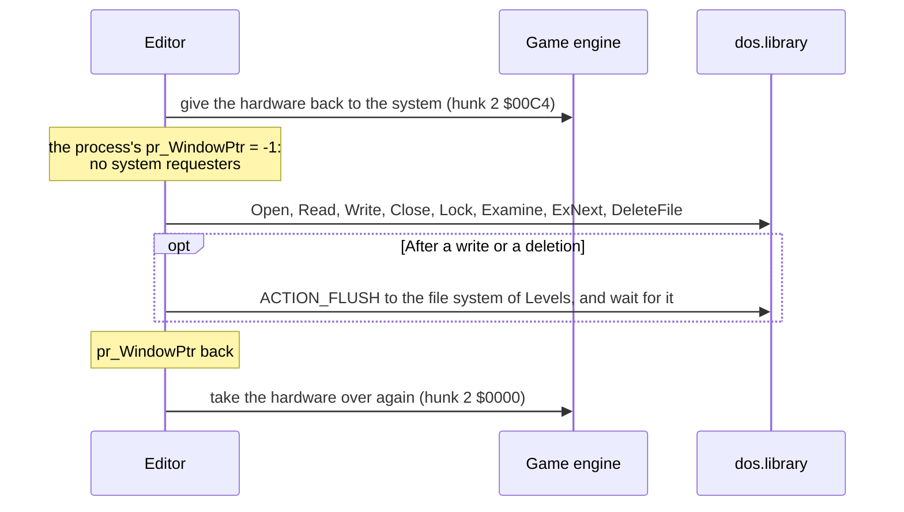

The flush makes sure that no disk transfer is under way when the game takes
the hardware back. A failed save reports a write-protected disk or that the
level could not be written. Under WHDLoad a failed write ends the game with
WHDLoad's error requester, every write turns the operating system on for a
moment with the display blanked, and the install's icon gives WHDLoad
`NOWRITECACHE`, so that a saved or deleted level is on the hard disk when
the editor says so.

## One source for two games

The editor refers to the game only through the names of its game interface
include, `game_lemmings.i` or `game_holiday94.i` (with `HOLIDAY94`
defined): the game's routines, data, global variable offsets, hook sites
with their continuation addresses and game constants. Code that differs is
chosen by symbols the includes define:

| Symbol | Lemmings | Holiday 1994 | Meaning |
| --- | --- | --- | --- |
| `FILES` | WHDLoad build | yes | Custom levels are `.lvl` files |
| `TWO_PLAYER` | yes | no | The two-player list, marker and match hooks |
| `RELOCATED` | no | yes | The editor is a hunk of the game's program; the patch tool writes the hooks |
| `STYLE_MASK` | no | `%101` | Styles the game has, when not all of 0 to `STYLES`-1 |
| `FADE_STEP` | no | yes | The play view fades in inside the play loop |
| `G_TRIES` | no | `$1B(A5)` | The failed tries the access code counts, kept across the custom levels |
| `G_MUSIC` | no | `$1D(A5)` | The level tune's flag, cleared when the editor leaves or restarts a level |
| `BLIT_HEIGHT` | no | hunk 2 `$78F2` | The rows the blitter routine clips to; the object preview cuts them to the view's 160 |

Macros cover what differs in code: `RESUME_ENDED` (the instructions the
hook after a level replaced), `INTS_OFF` and `INTS_ON` (the critical
sections, in the status register in Lemmings, with INTENA here) and
`STYLE_NAMES`. Only `holiday94.s` and `dos_file.s` are Holiday's own;
`bootstrap.s`, `title.s`, the level disk transport and `disk_codec.s` are
left out of its builds.

**Relocations.** The patch tool assembles the editor with the hunk bases
at `$01000000`, `$02000000` and so on, and once more with each base, and
the editor's origin, moved by `$10000000`. Every long word that changes
with a base is a relocation to its hunk; any other difference stops the
build. The floppy build has 8 relocations to hunk 1, 166 to hunk 2, 13 to
hunk 3 and 15 to hunk 5, the WHDLoad build 164 to hunk 2 and otherwise the
same. The editor's own code needs none.

**The disk.** The program grows from 143544 to 164496 bytes (163692 for
WHDLoad) and replaces the original on the disk, and the directory
`HolidayLemmings1994/Levels` is added. Every changed block gets its
checksum, the bitmap follows every allocation, and the patch tool checks
the whole file system before it writes the image. The patched floppy disk
has 745 free blocks, room for about 124 levels of six blocks each.

The WHDLoad slave accepts only the program of its own build: it refuses
any other length of `data/HolidayLemmings1994`, and so the floppy version's
program, whose file access needs the operating system. Anything else ends
with WHDLoad's "wrong version" requester.
