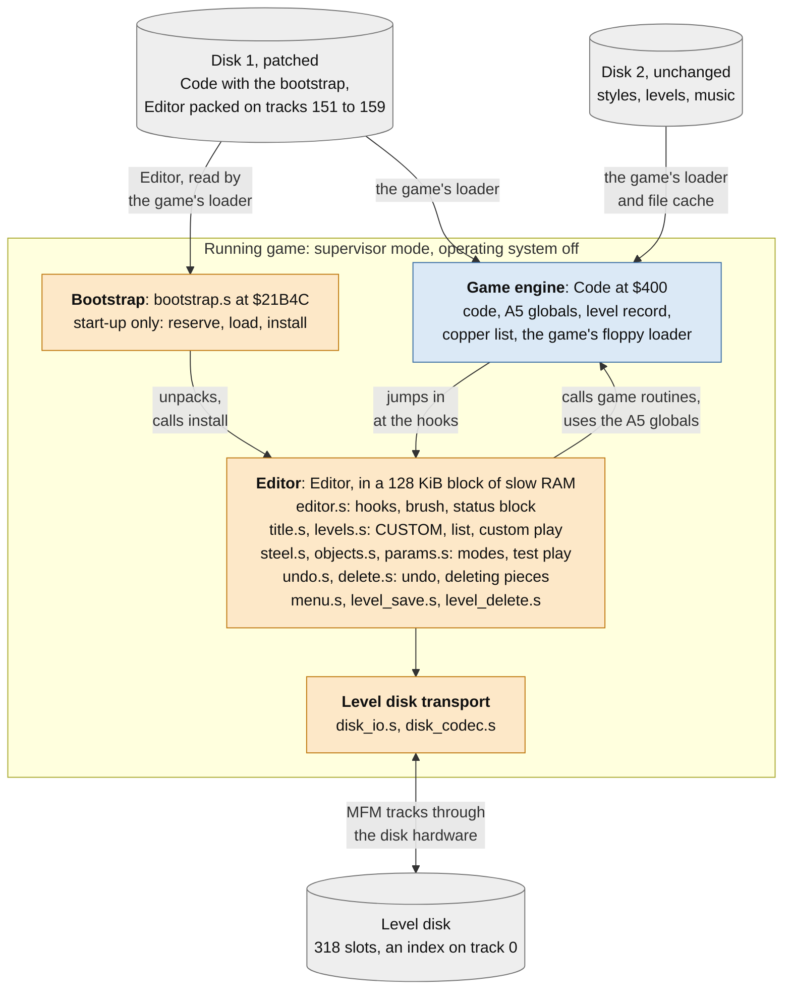
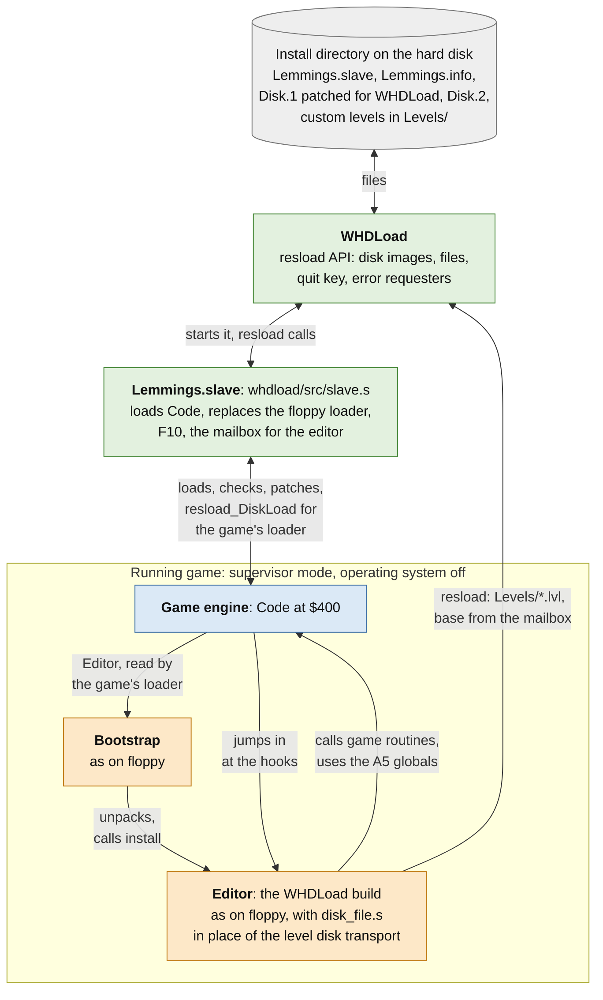
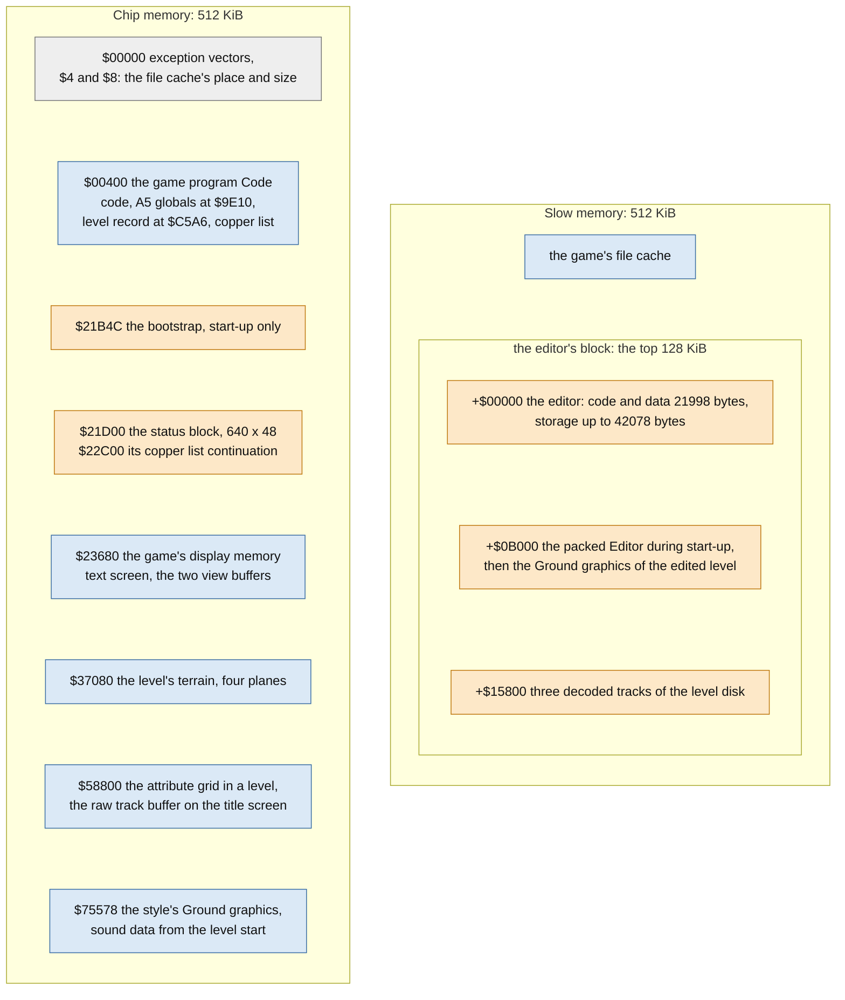
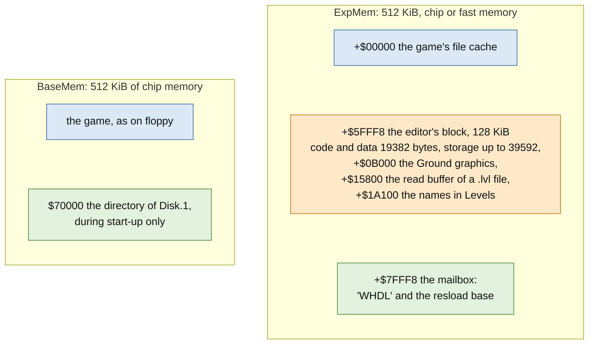
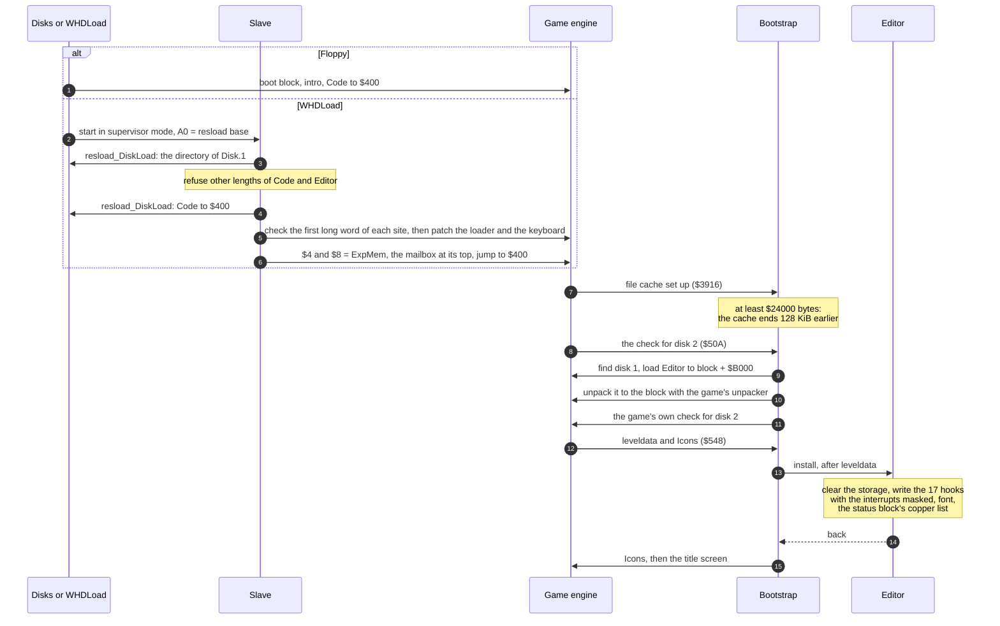
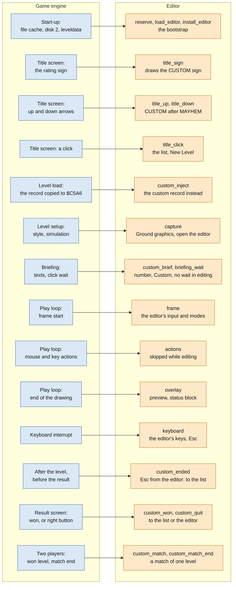
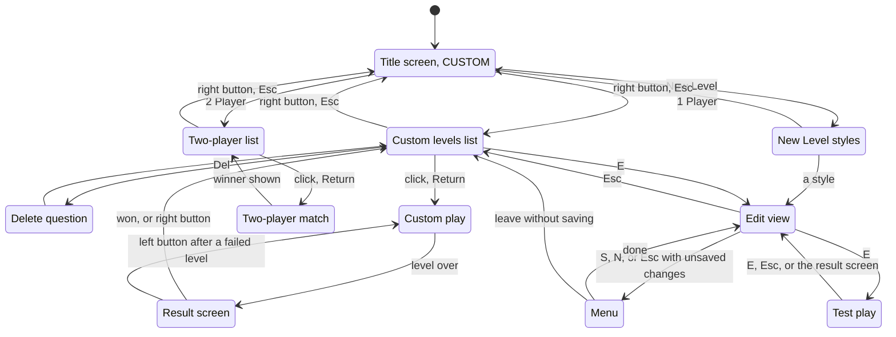
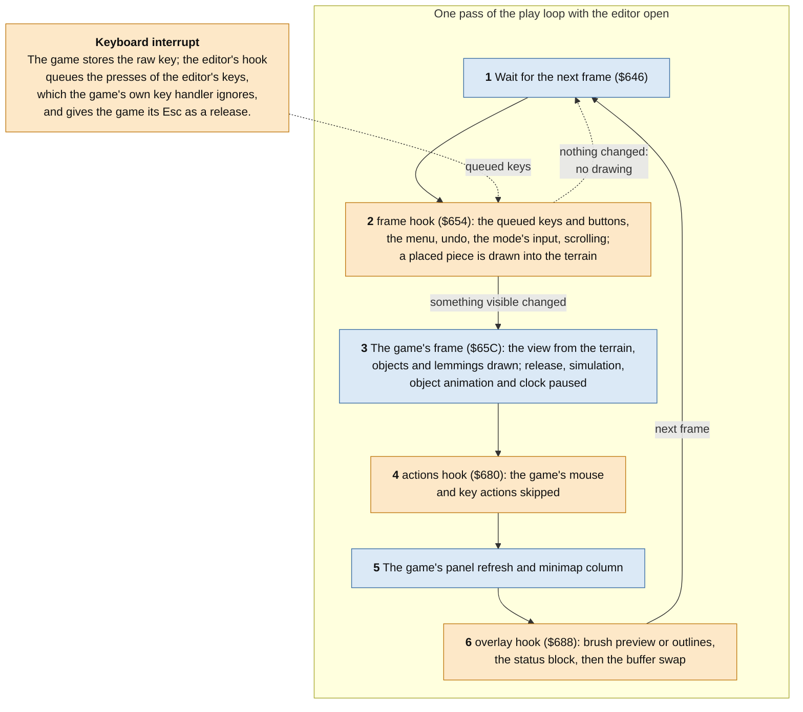
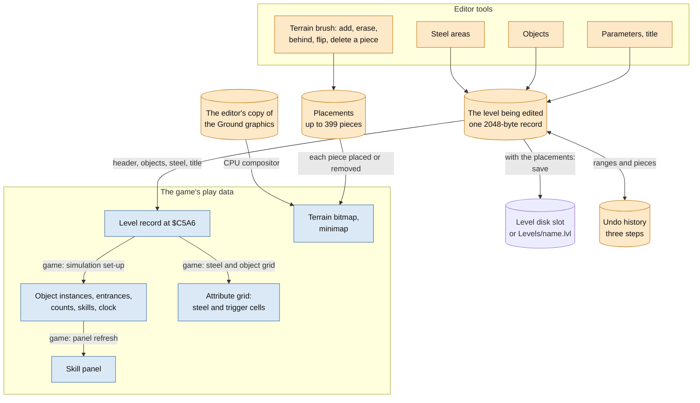
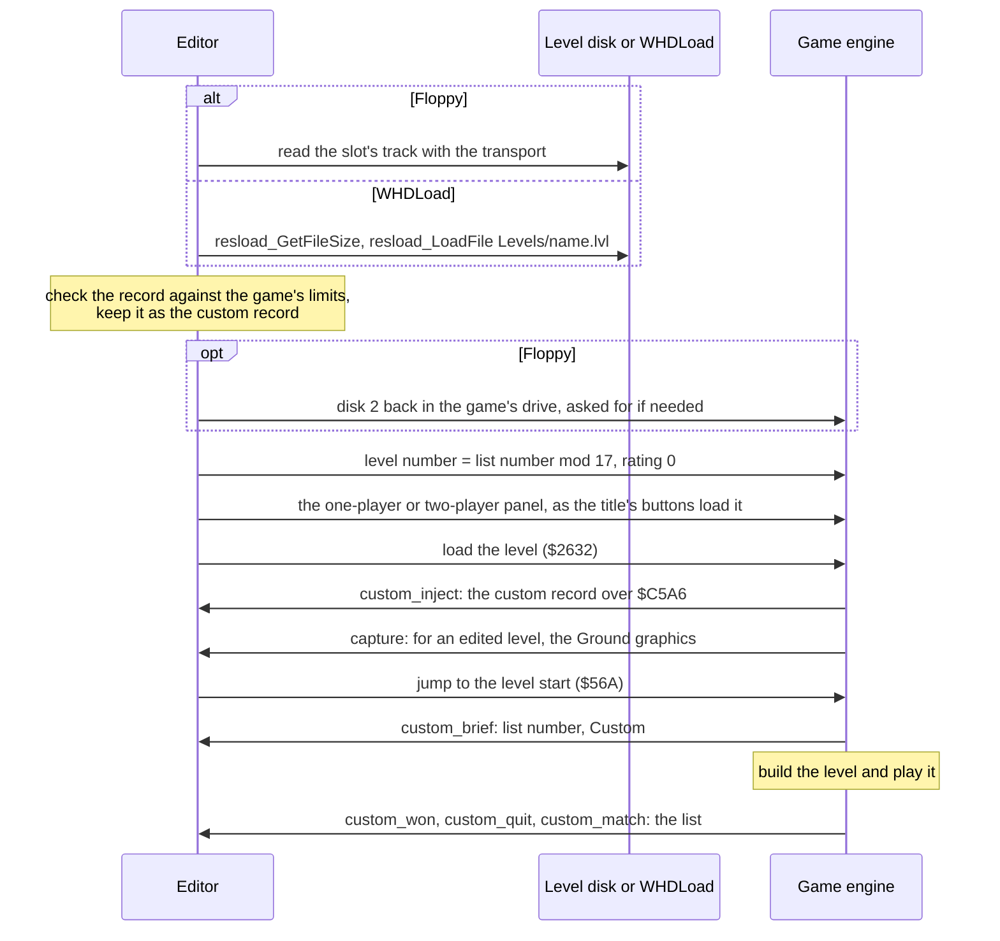

# Lemmings level editor: architecture

08.10.2026 Timo Heimonen (timo.heimonen@proton.me)

This document describes how the custom level editor, version 2.3.1, is
built into Amiga Lemmings (1991): what runs where, how the editor gets into
the game, and how editing, playing and saving a custom level use the game's
own code. It covers both versions, the floppy version for an A500 and the
WHDLoad install for a hard disk. It is written for readers of the sources:
the editor (`src/`: `editor.s` and the files it includes, `bootstrap.s`)
and the WHDLoad files (`whdload/src/`). The [README](../README.md)
describes the editor from the player's side. The same editor in Holiday
Lemmings 1994 is described in
[Holiday Lemmings 1994 level editor: architecture](architecture-holiday-lemmings-1994.md).

Addresses are hexadecimal runtime addresses of the game's main program
`Code`, which is loaded at `$400` (a file offset is the address minus
`$400`). The editor's names for them are in `game_lemmings.i`. A5 points to
the game's global variables at `$9E10`, and the game keeps A4 at its row
offset table `$A3C0` everywhere; inside its hooks the editor uses A4 for its
own state and sets it back before it enters the game's code.

## The idea in short

The editor is not a separate program. It is a module that is loaded next to
the unmodified game at start-up, and it runs inside the game: the game's own
code loads, builds, draws and plays every level, and the editor adds a fifth
rating, its list of custom levels and its editing tools at a small set of
hooks.

- **The level is the game's own record.** A custom level is the 2048-byte
  level record the game copies to `$C5A6` for every level it plays. A `.lvl`
  file is exactly that record, and a slot of a level disk holds it. The
  editor keeps one record as the level being edited and sets the game up
  again from it after every change. There is no second format and no
  conversion.
- **The game's code does the work.** Loading the style's graphics, the
  briefing, building the terrain and the objects, the attribute grid, the
  skill panel, the minimap, play, the result screens, the two-player mode
  and the text screen of the list are the game's routines, which the editor
  calls with the game's registers and globals. The editor adds what the
  game does not have: a CPU compositor for the terrain brush, the status
  block below the skill panel, its menu and, on floppy, its own disk code
  for the level disk.
- **A level is edited only at its start.** The editor opens paused at the
  first frame of the level, before the first lemming is released. Every
  change of the objects, steel areas or parameters sets the game up again
  as a level start does, and a test play starts the level again through the
  game's own level loader.
- **Few patch points, each one checked.** The patch tool writes three jumps
  and the bootstrap into `Code`, after checking the disks by SHA-256 and the
  original bytes of the three sites. At start-up the editor writes its 17
  hooks into that program; a few more places change only while they are
  needed. The WHDLoad slave changes 5 places of the game's floppy loader and
  keyboard interrupt, each after checking its original bytes.
- **The game's own levels are unchanged.** Each hook does the replaced
  instructions and goes on where the game would, unless a custom level is
  being played or edited. The game's rating stays at MAYHEM while CUSTOM is
  shown, and the level number and text mode the list changes are put back
  when it returns to the title screen. The game disks are never written to.

## Components

The floppy version:

The WHDLoad install:

| Part | Source | Role |
| --- | --- | --- |
| Game engine | `Code` on disk 1 (the user's own) | Unchanged on the disk except for the bootstrap and its three jumps; in memory only the hook sites change. It still runs the title screen, every level, the briefings, the result screens and the two-player mode. |
| Bootstrap | `bootstrap.s`, appended to `Code` | Keeps the top 128 KiB of the game's slow RAM file cache for the editor, loads the packed `Editor` from disk 1 with the game's loader, unpacks it with the game's unpacker and calls the editor's installer. Without enough slow RAM it does nothing and the game runs unchanged. |
| Editor | `editor.s` and the files it includes, packed as the file `Editor` | Adds CUSTOM to the title screen, the list of custom levels, New Level, the edit view with its status block and menu, test play, saving and deleting. Position independent: it runs wherever the block is. |
| Level disk transport | `disk_io.s`, `disk_codec.s` (floppy only) | Reads and writes the level disk's MFM tracks directly through the disk hardware, with verified writes; the game's loader cannot write. |
| WHDLoad file access | `whdload/src/disk_file.s` (WHDLoad build only) | Replaces the transport: the editor reaches WHDLoad's resload functions through a mailbox the slave leaves above the editor's block. |
| WHDLoad slave | `whdload/src/slave.s` | Loads `Code` from `Disk.1`, replaces the floppy loader's drive search and track read with `resload_DiskLoad`, gives the game's file cache the expansion memory, adds the quit key and starts the game. |
| Patch tool | `patch.py` | Accepts only the supported disks by SHA-256, appends the bootstrap to `Code`, writes its three jumps, rewrites the directory of disk 1 and puts `Editor` behind its boot loader. With `--whdload` it builds the version for the WHDLoad install. |

## Memory

The floppy version runs on an A500 with 512 KiB of chip memory and 512 KiB
of slow memory. The game's boot block leaves the place and size of the slow
memory at `$4` and `$8`, and the game uses it as its file cache, in which
it keeps the files of disk 2 once they are loaded. The bootstrap lowers the
end of that cache by 128 KiB, so the top of the slow memory becomes the
editor's block:

The editor's code and its storage must stay below `+$B000`; the build
checks this from the assembler's symbols. Most of the storage is the list
(the titles of up to 318 levels, 32 bytes each, and their slots and
states), two level records (the level being edited and the record a save
builds), the placements of the terrain brush (up to 399 pieces of 4 bytes),
the editor's font and the undo history (three steps). The Ground graphics
are the editor's own copy of the style's terrain pieces, loaded when an
edited level starts, because the game overwrites its own copy with sound
data. Slow memory is not reachable by the blitter, so the editor draws the
terrain pieces with the CPU.

The chip memory the editor needs is between the end of the game program
and the game's display memory: the 3840-byte bitmap of the status block and
its 40-byte copper list. The level disk transport borrows chip memory the
game is not using at the moment for the raw MFM track: in a level the view
buffer that is not displayed, while the level is paused, and on the title
screen and in the list the game's own raw track buffer.

Under WHDLoad the game keeps its chip memory as on floppy, and the slave
gives it the expansion memory instead of the slow memory:

The editor finds the mailbox directly above its block. Without it the
WHDLoad build's file access refuses every operation.

## Start-up

On floppy, disk 1 is still in a drive when the game looks for disk 2, also
on a machine with one drive, so the bootstrap reads `Editor` there, before
the game asks for disk 2. `Editor` lies on tracks 151 to 159 of disk 1,
which neither the boot chain nor the game reads; the game's loader finds a
file by adding up the lengths of the directory entries before it, so the
patch tool puts a placeholder entry over the boot loader and the packed
intro, and `Editor` after it at `$CFA00`. `Editor` is packed in the format
of the game's own unpacker (`$3934`).

Under WHDLoad the slave skips the boot block and the intro: `Code` sets up
its own stack, supervisor mode and hardware. The bootstrap then loads
`Editor` exactly as from floppy, through the replaced loader.

## Hooks into the game engine

The editor runs only when the game jumps to it. Each hook replaces whole
instructions with a jump to the editor; when there is nothing for the
editor to do (the game's own levels, a custom level played from the list
while the editor is closed, the title screen outside CUSTOM) the hook does
the replaced instructions itself and goes on where the game would.

The bootstrap's jumps, written into `Code` by the patch tool after it has
checked their original bytes (`JMP` and `NOP`; at `$50A` the `JMP` alone):

| Hook | Address | Replaced | What the bootstrap does |
| --- | --- | --- | --- |
| `reserve` | `$3916` | `ADDA.L $8.W,A1` / `MOVE.L A1,$F8(A5)`: the end of the file cache | Ends the cache 128 KiB earlier when it has at least `$24000` bytes; `$F8(A5)` is then the editor's block |
| `load_editor` | `$50A` | `BSR $3C6E` / `TST.W D0`: the check for disk 2 | Finds disk 1 with the game's loader (`$7FB2`, by its first file name `main`), loads `Editor` to the block at `+$B000` and unpacks it to `+$0`, then does the check for disk 2 |
| `install_editor` | `$548` | `BSR $3D48` / `BSR $2C7E`: leveldata and Icons | Loads leveldata, calls the editor's installer when `Editor` was unpacked, loads Icons |

The editor's permanent hooks, written once by its installer from the table
`hooks` in `editor.s` (a `JMP` and `NOP`s; at `$34AA` a `JSR`):

| Hook | Address | Where in the game | What the editor does |
| --- | --- | --- | --- |
| `keyboard` | `$174E` | The keyboard interrupt stores the raw key | Keeps the store and the CIA acknowledge; follows the Shift keys; queues key presses for the menu and the list; while a custom level is edited takes the editor's keys, and passes its Esc to the game as a release |
| `frame` | `$654` | The play loop's buffer swap at the frame start | Opens the editor at the first frame of an edited level and pauses it; runs the editor's input, modes and menu; skips the frame's drawing when nothing visible changed, and otherwise leaves the swap to `overlay`; with the editor closed, the game's swap |
| `actions` | `$680` | The play loop calls the game's mouse and key actions | Skipped while the editor is open |
| `overlay` | `$688` | The play loop refreshes the panel and a minimap column | After them, the brush preview, the outlines and the status block, then the buffer swap |
| `capture` | `$2762` | Level setup: style data, then the simulation | Resets the editor; for an edited level loads and unpacks the style's `GroundN` into the block and arranges for the editor to open at the first frame, except in a test play |
| `custom_inject` | `$26E6` | Level load, after the record is copied to `$C5A6` | For a custom level copies its record over it, so the style, the graphics and everything after come from it; marks the game's level bank cache stale |
| `custom_brief` | `$34AA` | Briefing: texts and preview | The level's list number, the rating `Custom` and `;` for `:` in the title |
| `briefing_wait` | `$3502` | Briefing: wait for a click | No wait for a level being edited or test played |
| `custom_ended` | `$706` | The level has ended and faded out | After leaving the editor with Esc, back to the list without a result screen |
| `custom_won` | `$760` | Result: enough saved, on to the next level | The comment and a click, then the list, or after a test play the editor; no next level, no access code |
| `custom_quit` | `$818` | Result: right button after a failed level | Back to the list, or after a test play to the editor |
| `custom_match` | `$918` | Two players: a level won | A custom level is a match of one level: the winner at once |
| `custom_match_end` | `$9BE` | Two players: the end of the match | Back to the list instead of the title screen |
| `title_sign` | `$2CCA` | The title screen draws the rating sign | In CUSTOM, the CUSTOM sign built from the FUN sign with the editor's lettering |
| `title_up` | `$35CA` | The up arrow of the rating | At MAYHEM, CUSTOM |
| `title_down` | `$35FC` | The down arrow of the rating | From CUSTOM back to MAYHEM |
| `title_click` | `$33C0` | A click on the title screen | In CUSTOM, 1 Player opens the list, 2 Player the two-player list, New Level the styles |

Changed only while they are needed:

| Place | Address | Changed while | Change |
| --- | --- | --- | --- |
| Play copper list: the display window | `$84EE` | the editor is open | DIWSTOP `$24C1` instead of `$F4C1`: 48 more lines below the skill panel |
| Play copper list: its end | `$8668`, 12 bytes | the editor is open | `COP2LCH`, `COP2LCL` and `COPJMP2` to the continuation at `$22C00`, which shows the status block's hires plane at `$21D00` |
| Play colours 0 to 4 | `$850E` | the menu is open | The menu's colours; the level's are put back when it closes |
| Skill selection sprite | `$144F2` | the editor is open | Cleared |
| Pause flag | `$39(A5)` | the editor is open | Set: no lemming is released, the objects and the clock stand still |

The copper list is restored when the editor closes and at every level
setup.

The WHDLoad slave's patches, for the start from hard disk:

| Patch | Address | Game code | Replacement |
| --- | --- | --- | --- |
| Drive search | `$80D6` | Searches the drives for the disk named by its first file name | Selects `Disk.1` (`main`) or `Disk.2` (`Grou`) and reads its directory with `resload_DiskLoad` |
| Track read | `$8164` | Reads and decodes MFM tracks from the drive | The same bytes from the selected disk image with `resload_DiskLoad` |
| Motor on, off | `$841C`, `$8438` | Drive motor | `RTS` |
| Keyboard | `$175A` | The keyboard interrupt's CIA handshake | The same, then F10 quits |

So the game's "insert disk 2" prompts never appear under WHDLoad.

## Screens and control flow

The list, the New Level styles and the delete question are drawn on the
game's own text screen, the one of the level briefing: 13 rows of 40
characters in the game's font, each row with its own palette, faded with
the game's routines. Custom play, test play and the edit view use the
game's level start, briefing, play view and result screens. The editor's
menu (the title, saving, disk prompts, messages and the question before
leaving) is drawn with the editor's own font into the displayed view
buffer, over the paused level.

When the list opens from the title screen it keeps the game's level number
and text mode. A custom level is played as a level of rating 0, with its
number in the list modulo 17 as the level number, which gives it the tune of
the game's rotation; the game's rating stays at MAYHEM while CUSTOM is
shown, and when the list returns to the title screen the editor puts these
values back and, after a played level, reloads Icons as the game does after
its levels. On floppy with one drive the list asks for disk 2 again before a
level starts and before it returns to the title screen, because the game
loads its files through the directory of disk 2 from the drive it found
disk 2 in.

## The edit view

Opening a level for editing starts it as for play. E in the list, or a
style in New Level, puts the level into the editor's record, marks it as
edited and loads it as the game loads a level, then enters the game's
level start:

1. While the game loads the level, its level setup hook (`capture`) loads the style's `GroundN` with the
   game's file loader into the editor's block and unpacks it, for the
   brush; the game's own copy becomes sound data during the level start.
2. The briefing does not wait for a click (`briefing_wait`).
3. At the level's first frame the frame hook opens the editor: it sets the
   game's pause flag, hides the skill selection sprite and shows the status
   block through the copper list. No lemming has been released.

From then on the game's play loop keeps running, paused, and the editor
works inside it through its three play loop hooks:

Blue steps are the game's routines, orange ones the editor's. While the
menu is open the frame hook runs the menu instead and the loop draws
nothing; saving and the level disk transport run synchronously from there.

### From the record to the screen

Every tool changes the level being edited, and the game's play data
follows from it by the game's own routines wherever they can be used:

- **Terrain** (`editor.s`): the brush draws the selected piece with the
  CPU into the level's terrain bitmap from the editor's copy of the Ground
  graphics: added, erased (cleared in all four planes) or behind the
  existing terrain, as the game draws pieces. Then the game's routines clear
  the collision guard rows and update the minimap, as the game's own level
  build does. Each piece is also appended to the placements, in the format
  of the record's terrain pieces. A level holds at most 399 pieces, since
  the game's list needs an end marker.
- **Steel areas, objects and parameters** (`steel.s`, `objects.s`,
  `params.s`): a change goes into the record, and `level_apply` copies the
  record's header, objects, steel areas and title to the game's record at
  `$C5A6`, sets the simulation up again (the object instances, the
  entrances, the counts, the skills and the clock) and rebuilds the
  attribute grid with the game's routines, keeping the pause, the start-up
  counter and the scroll. Nothing else refers to the old state, since no
  lemming has been released.
- **Objects** are drawn by the game from their instances, paused at the
  frame the level starts with. The preview at the cursor is drawn with the game's blitter
  routine, frame after frame.
- **Undo and redo** (`undo.s`) keep three steps: a range of the record
  (header, objects, steel areas or title), a placed terrain piece or a
  deleted one with its place in the level's list. An entry is
  swapped, not copied, so the same entry redoes what it undid. Removing a
  piece, by undo or by deleting it (`delete.s`), rebuilds the terrain under
  it with the editor's compositor: its rectangle is cleared and every piece
  that overlaps it is drawn again in order. The game's own terrain build
  cannot be used for this, its Ground graphics having become sound data.
- **Saving** (`level_save.s`) asks for the title, builds the record with the
  placements after its terrain pieces, checks it against the game's limits
  and stores it. Afterwards the saved record is the level being edited and
  the placements are part of it.
- **Test play** (E) appends the placements to the record and starts the
  level again through the game's level loader, so the game builds the
  terrain from the record with its own renderer. The game plays its copy
  at `$C5A6`, so play never changes the level being edited. E or Esc
  during the test play, or the result screen, starts the level again with
  the editor open; the undo history survives.
- **Leaving** (Esc) closes the editor, after asking when the level has
  unsaved changes, and ends the level with the game's own Esc action. The
  game fades the level out, and `custom_ended` returns to the list.

## Playing a custom level

Play from the list, the two-player list and opening a level for editing
all enter a level through the same path (`list_start`); a test play and a
retry load the level again through the same game routines:

The game selects a level by copying its record from a level bank to
`$C5A6`. The hook after that copy puts the custom record there instead, so
the game's own loader, style loading, level build and play run on the
custom level unchanged. The game's cache of the unpacked level bank is
marked stale, so that the next original level is copied again. A level
played from the list ends at the game's result screen with its own comment;
the hooks only change where the game goes next.

## Where the levels are kept

| What | Floppy | WHDLoad |
| --- | --- | --- |
| The custom levels | A level disk: 318 slots of 2816 bytes on tracks 1 to 159, two per track, and an index on track 0 with CRC-32 checks | `.lvl` files in the install's directory `Levels` |
| Finding them | The transport looks for the level disk in every drive and asks for it when it is missing | `resload_ListFiles`: up to 318 `.lvl` names, sorted, into the editor's block |
| The list | The occupied slots from the index, the titles from the data tracks of a page | The titles of a page read from their files |
| Opening and playing | The slot's track; a level that does not pass the checks is listed as damaged | `resload_GetFileSize`, then `resload_LoadFile`; the same checks |
| Saving | Into the level's slot, a new level into the lowest free one | `resload_SaveFile`; a new level as the first free `LevelNNN.lvl` |
| Deleting | The slot cleared, then its index entry | `resload_DeleteFile`, then `resload_GetFileSize` to confirm |

On the level disk a save writes the whole data track, reads it back and
compares it, then reads track 0 again, compares it with its first read and
writes and verifies the index. So the index never lists a level before its
data has been verified, and a level disk in another drive or a changed disk
is noticed before anything is written. The editor writes only to a disk
whose track 0 is a valid level disk header; the game disks and the save
disks of version 1.x are never written to.

Under WHDLoad every write turns the operating system on for a moment, with
the display blanked. The install's icon gives WHDLoad `NOWRITECACHE`, so
that a saved or deleted level is on the hard disk when the editor says so.
With WHDLoad's write cache a deleted file stays listed until WHDLoad quits,
so the editor remembers the names it deleted in the session and leaves them
out of the list.

## Floppy and WHDLoad from one source

The two versions are the same editor, assembled twice. The WHDLoad build
defines `WHDLOAD`, which also defines `FILES` (the custom levels are files):

- `disk_io.s` includes `whdload/src/disk_file.s` instead of the level disk
  transport, and `disk_codec.s` is left out. The list, saving and deleting
  call the resload functions through the mailbox, with WHDLoad's register
  interface.
- The prompts for the level disk and for disk 2 do not exist: WHDLoad's
  replaced loader reads the game's files from the disk images.
- The bootstrap, the hooks, the edit view, test play and the level checks
  are the same in both builds.

The WHDLoad slave accepts only the disk images of its own build: `Code` and
`Editor` in the directory of `Disk.1` must have exactly the lengths of that
build, which also refuses the floppy version's images, and the first long
word of every patch site is checked. Anything else ends with WHDLoad's
"wrong version" requester.
